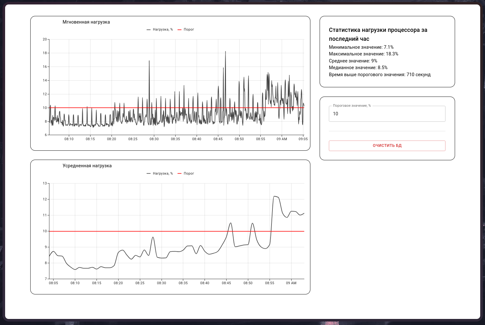
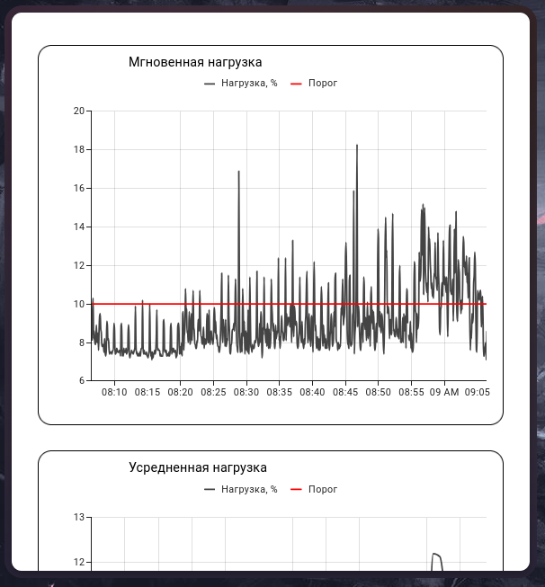
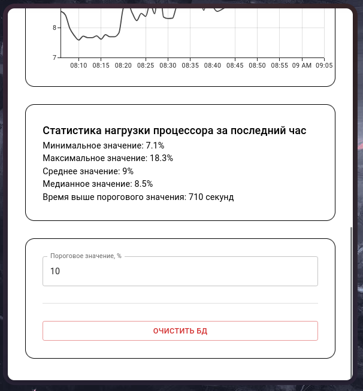

# CPU Load Monitor
Веб-приложение для мониторинга нагрузки процессора в реальном времени.

## Скриншоты программы
### Большое окно (больше ~900px)

    
### Маленькое окно (до ~900px)
<table>
  <tr>
    <td></td>
    <td></td>
  </tr>
</table>

## Требования 
- Docker + docker-compose для запуска в контейнерах
- Python + node.js для нативного запуска

## Начало работы с программой
```bash
git clone https://github.com/amoxapineee/cpu-monitor # клонирование репозитория
cd cpu-monitor # перейти в папку с исходным кодом 
echo -e "UID=$(id -u)\nGID=$(id -g)" > .env # выполняется 1 раз для запуска контейнера от пользователя а не от root
# т.к. если первый запуск выполняется с docker без .env файла с ID пользователя, не будет работать запись в БД при нативном запуске
```

### Простой запуск (docker)
```bash

docker-compose up -d
```
Программа доступна по адресу: http://localhost:5173

### Продвинутый запуск (нативная программа)
#### Настройка перед использованием
```bash
source .venv/bin/activate # активировать виртуальное окружение python (sh/bash)
# для других оболочек использовать соответствующий файл, например activate.fish для fish-shell
pip install -r requirements.txt # установка зависимостей python (fastapi, SQLAlchemy, psutil)
cd frontend # перейти в папку с фронтэндом
npm install # установка модулей для фронтэнда (react, material-ui, mui x-charts)
```

#### Запуск одной командой (без логов)
```bash
make # или make run
# для остановки использовать следующую команду:
make stop
```

#### Ручной запуск (не рекомендуется, запускать только если нужны логи uvicorn и vite)
```bash
# cpu-monitor/
uvicorn backend.main:app --reload --port 8000 # бэкенд
# в отдельном окне из той же папки
cd frontend
npm run dev # фронтэнд
```

## Структура проекта
```bash
cpu-monitor/
├── backend/                        # fastapi + sqlalchemy (sqlite)
│   ├── main.py                     # точка входа в программу
│   ├── database.py                 # SQLAlchemy модель и получение сессии
│   ├── metric_collector.py         # сбор нагрузки процессора (psutil)
│   ├── fetch_database.py           # выборка данных из БД
│   ├── clear_database.py           # очистка базы данных
│   ├── schemas.py                  # схемы ответов (pydantic)
│   ├── util.py                     # вспомогательные функции
│   └── Dockerfile                  # описание контейнера для бэкенда
├── frontend/                       # react + material-ui
│   ├── public/
│   │   └── favicon.svg             # иконка программы
│   ├── src/
│   │   ├── components/
│   │   │   ├── CPUChart.tsx        # графики (mui x-charts)
│   │   │   ├── CPUStats.tsx        # вывод дополнительной статистики
│   │   │   ├── ControlPanel.tsx    # панель управления (поле ввода и кнопка)
│   │   │   └── ErrorMessage.tsx    # сообщение об ошибке
│   │   ├── hooks/
│   │   │   ├── useCPUData.tsx      # хук для загрузки данных для графиков
│   │   │   └── useCPUStats.tsx     # хук для загрузки дополнительной статистики
│   │   ├── App.tsx                 # главный компонент программы
│   │   ├── api.ts                  # функции для взаимодействия с API
│   │   ├── main.tsx                # включение react
│   │   └── types.ts                # кастомные типы typescript
│   ├── index.html                  # точка входа
│   ├── package.json                # зависимости
│   ├── package-lock.json           # фиксированные зависимости
│   ├── tsconfig.app.json
│   ├── tsconfig.json
│   ├── tsconfig.node.json 
│   ├── vite.config.ts
│   └── Dockerfile                  # описание контейнера для фронтэнда

│   data/metrics.db                 # файл базы данных sqlite
├── screenshots/                    # скриншоты программы
├── requirements.txt                # зависимости python
├── docker-compose.yml              # оркестрация контейнеров
├── Makefile                        # файл для работы с командой make
└── README.md                       # этот файл
```

## API
Для лучшего понимания смотреть документацию по адресу http://localhost:8000/docs

| Метод | Путь | Описание |
| ----- | ---- | -------- |
| GET | /api/cpu/load?type=instant | Мгновенные значения за последний час |
| GET | /api/cpu/load?type=average | Те же значения, усредненные по минутам |
| GET | /api/cpu/stats?threshold=80 | Статистика за последний час (threshold - пороговое значение в диапазоне 0-100, по умолчанию 80) |
| DELETE | /api/db/clear | Очистка базы данных за исключением последнего часа

## Технологии
### Бэкенд:
- **FastAPI** - Веб-фреймворк для создания API на python
- **SQLite** - легкая файловая база данных, удобная для локального использования
- **SQLAlchemy** - Библиотека для упрощенной работы с базами данных
- **psutil** - Библиотека для отслеживания загрузки системы

### Фронтенд:
- **React** - Библиотека JavaScript (TypeScript) для создания пользовательских интерфейсов
- **Material UI** - Библиотека готовых компонентов для React
- **MUI X Charts** - Расширение Material UI для построения графиков
- **Vite** - Инструмент для сборки фронтeнда

### Контейнеризация:
- Docker - сборка приложения в контейнеры
- Docker Compose - управление контейнерами

## Почему именно этот стек
- **FastAPI** - простой, быстрый, автогенерирует документацию (Swagger) и валидацию (Pydantic)
- **SQLite** - встраиваемая архитектура, простая в настройке, все хранится в одном файле, работает локально
- **React + MUI** - быстрая сборка адаптивного интерфейса с готовыми компонентами и графиками
- **Docker** - воспроизводимость окружения на любой операционной системе
